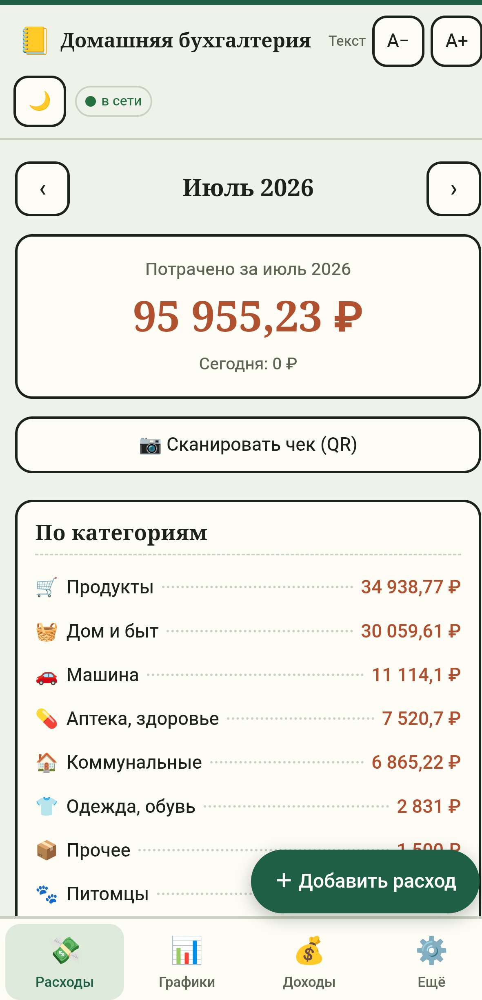
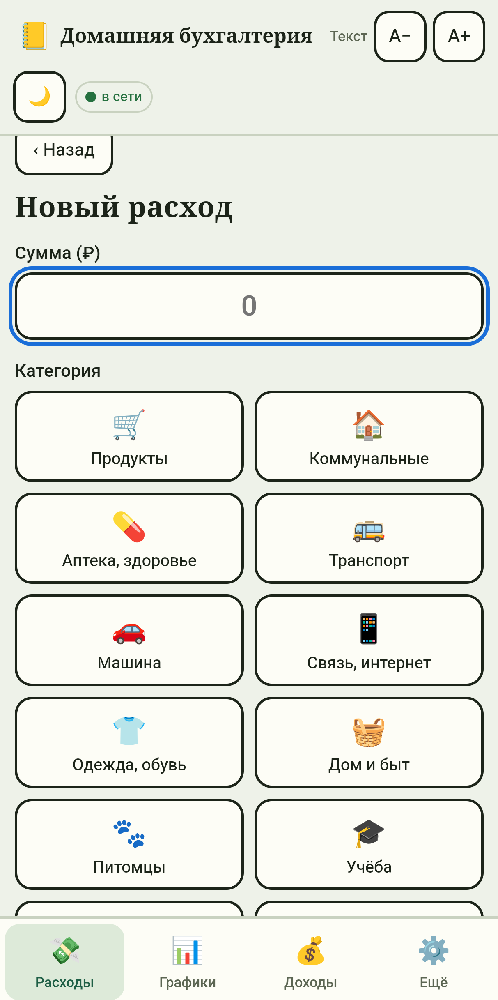
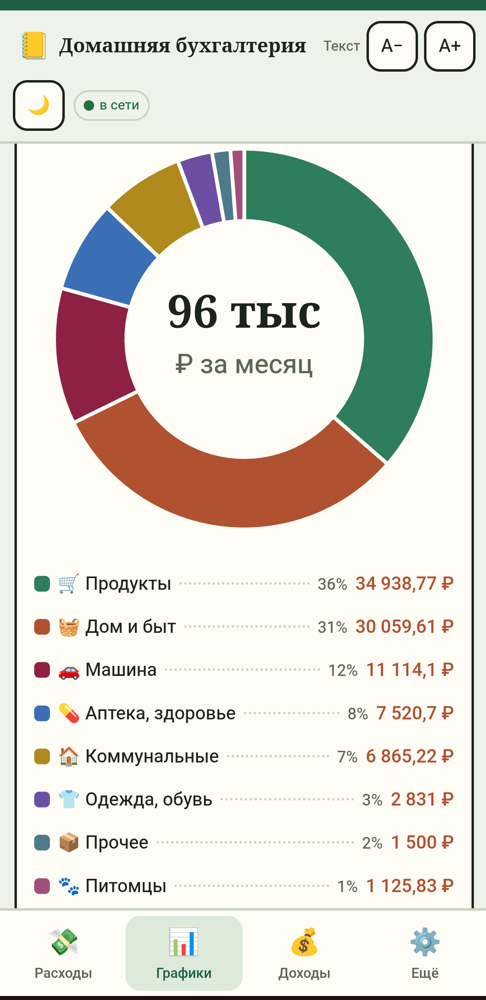
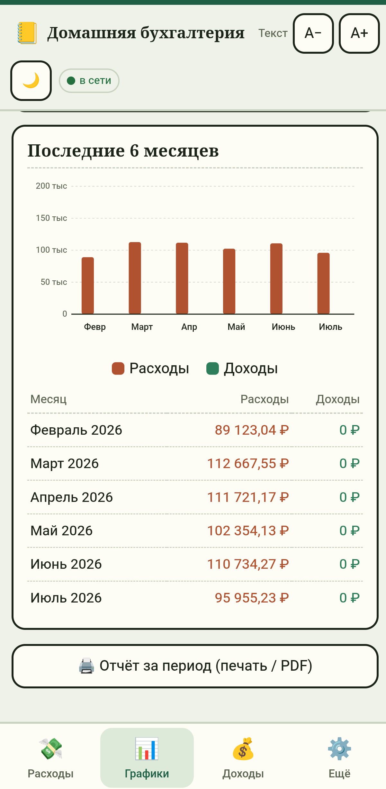
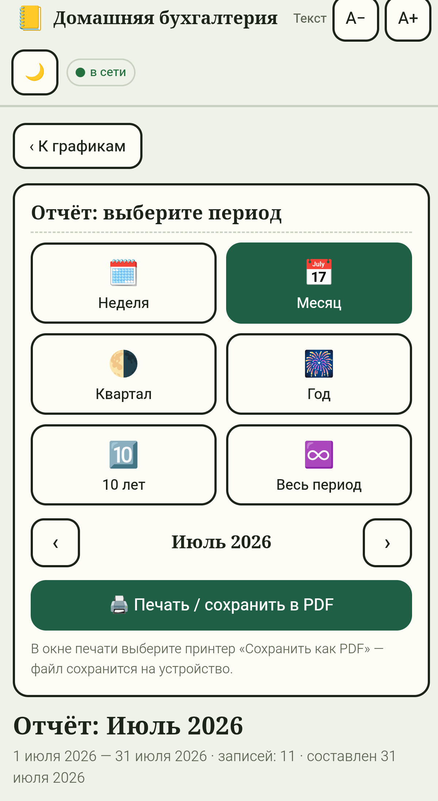
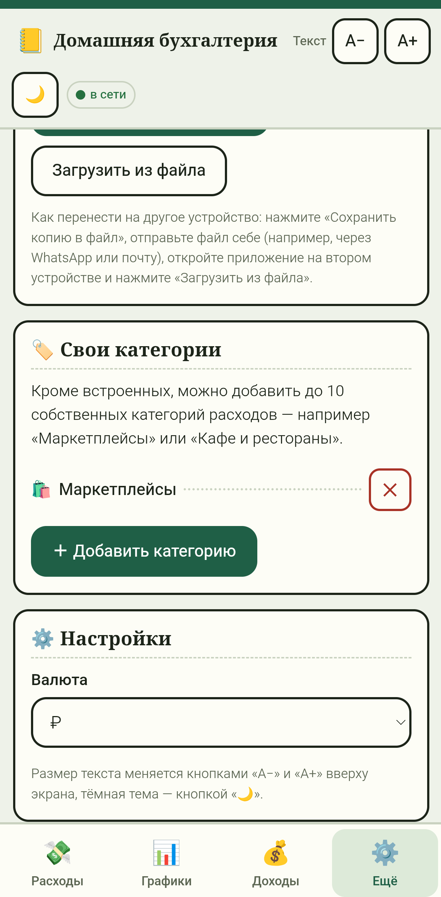

# Домашняя бухгалтерия

Учёт домашних расходов и доходов в одном окне.
Приложение-страница, которое ставится на телефон или компьютер и работает без интернета.


**[Открыть приложение](https://zubakamaraka.github.io/home-budget/)** — ничего устанавливать не обязательно, открывается прямо в браузере.

---

Приложение сделано в первую очередь для учёта трат: крупная сумма месяца на виду,
разбивка по категориям, записи по дням. Доходы вынесены в отдельную вкладку, чтобы
не отвлекать. Весь интерфейс масштабируется кнопками «А−» и «А+» без потери чёткости —
задумано для человека, который видит не очень хорошо. Управление сведено к трём
действиям: ввести сумму, выбрать категорию, сохранить.

- расходы и доходы, разбивка по категориям, записи сгруппированы по дням
- свои категории (до 10) с выбором значка — например «Маркетплейсы» или «Кафе»
- графики: круговая диаграмма по категориям и столбцы за последние 6 месяцев
- отчёты за неделю, месяц, квартал, год, 10 лет и весь период — с печатью и сохранением в PDF
- сканирование QR-кода с кассового чека: сумма и дата подставляются сами (для чеков с данными в коде, например российских по 54-ФЗ)
- масштаб текста, светлая и тёмная тема
- индикатор «в сети / офлайн» вверху экрана
- резервная копия в файл и загрузка из файла — заодно способ перенести данные между устройствами
- всё хранится только на устройстве, ничего никуда не отправляется

---

## Как выглядит

| Расходы | Добавление расхода | Графики |
| --- | --- | --- |
|  |  |  |
| Сумма месяца, разбивка по категориям, записи по дням | Сумма, категория из плиток, дата, заметка | Круговая диаграмма расходов за месяц |

| За 6 месяцев | Отчёт за период | Свои категории |
| --- | --- | --- |
|  |  |  |
| Столбцы расходов и доходов, таблица помесячно | Неделя, месяц, квартал, год, 10 лет, весь период | До 10 своих категорий со значками |

---

## Требования

|            |                                                              |
| ---------- | ------------------------------------------------------------ |
| Телефон    | Android с браузером Chrome                                    |
| Компьютер  | Windows с Chrome или Edge                                     |
| Интернет   | нужен только при первом открытии и для обновлений             |
| Сканер чека | камера устройства; работает по защищённому адресу (https), поэтому только на сайте, а не при открытии файла напрямую |

Браузер Chrome рекомендуется: в некоторых других (например, Яндекс.Браузере) поле
ввода и экранная клавиатура на телефоне ведут себя не лучшим образом. После установки
приложения через Chrome всё работает как надо.

---

## Установка

Приложение — это [PWA](https://ru.wikipedia.org/wiki/Progressive_Web_App): оно
открывается по ссылке как обычный сайт, а затем ставится на устройство своей иконкой
и дальше работает без интернета.

1. Открыть **[ссылку на приложение](https://zubakamaraka.github.io/home-budget/)** в Chrome.
2. На Android: меню Chrome (⋮) → «Установить приложение» или «Добавить на главный экран».
   На Windows: значок установки в адресной строке или меню → «Установить».
3. На рабочем столе появится значок с зелёной книгой — дальше приложение открывается
   одним нажатием и работает офлайн.

Первое открытие обязательно с интернетом — приложение сохраняет само себя на устройство.
После этого сеть больше не нужна.

---

## Данные и перенос между устройствами

Все записи хранятся **только в браузере устройства** и никуда не отправляются —
ни на GitHub, ни на какой-либо сервер. Это же означает, что синхронизации «сама собой»
между телефоном и компьютером нет; перенос делается вручную и под контролем пользователя:

1. На первом устройстве: «Ещё» → «Сохранить копию в файл».
2. Переслать файл на второе устройство (мессенджер, почта — как удобно).
3. На втором устройстве: «Ещё» → «Загрузить из файла» → «Дополнить» (добавит только
   недостающие записи, без дублей) или «Заменить всё».

Свои категории хранятся внутри копии и переносятся вместе с записями. Резервную копию
стоит делать хотя бы раз в месяц: она защищает и от смены устройства, и от случайной
очистки данных браузера.

---

## Обновление

Приложение обновляется само. Достаточно заменить в репозитории изменённые файлы
(обычно `index.html`, при изменениях в офлайн-логике ещё и `sw.js`) — при следующем
открытии с интернетом устройство подтянет свежую версию. Чистить кэш вручную не нужно:
за это отвечает стратегия «сеть вперёд» в `sw.js`.

Локальные данные при обновлении не трогаются — они хранятся отдельно от файлов
приложения. Данные могут пропасть только при очистке в браузере пункта «файлы cookie
и данные сайтов», удалении приложения «вместе с данными» или смене адреса репозитория
(поэтому имя `home-budget` менять не стоит).

---

## Устройство проекта

```
index.html              всё приложение: интерфейс, логика, стили в одном файле
manifest.webmanifest    описание PWA: имя, иконки, цвета
sw.js                   service worker: офлайн-режим и автообновление
jsQR.js                 распознавание QR-кода с чека (работает офлайн)
icon-192.png            иконки приложения
icon-512.png
icon-512-maskable.png   иконка с безопасной зоной для Android
apple-touch-icon.png    иконка для iOS
```

Приложение написано без сборщиков и внешних сервисов: обычные HTML, CSS и JavaScript.
Единственная сторонняя библиотека — [jsQR](https://github.com/cozmo/jsQR) для чтения
QR-кода, она лежит рядом файлом и загружается локально.

---

## Как работает сканирование чека

Российский кассовый чек по 54-ФЗ несёт QR-код, внутри которого записаны сумма (`s=`)
и дата с временем (`t=`). Приложение читает эти поля прямо из кода — камерой или из
фотографии — и подставляет в форму расхода, остаётся выбрать категорию. Всё происходит
на устройстве, без интернета и без обращения к налоговой.

Список товаров из чека так получить нельзя: в QR его нет, а расшифровка по позициям
доступна только через онлайн-сервисы ОФД/ФНС. Поэтому приложение берёт из чека сумму
и дату, а категорию человек ставит сам. На чеках без данных в коде (например,
казахстанских, где в QR только ссылка) приложение честно предложит ввести сумму вручную.

---

## Лицензия

Код распространяется по лицензии MIT — им можно свободно пользоваться, изменять и
распространять при условии сохранения указания авторства. Полный текст — в файле
[`LICENSE`](LICENSE).

Приложение не собирает и не передаёт никаких данных пользователя: вся бухгалтерия
остаётся на устройстве владельца.
